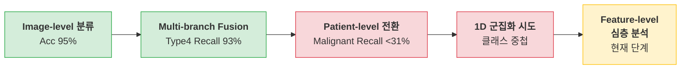
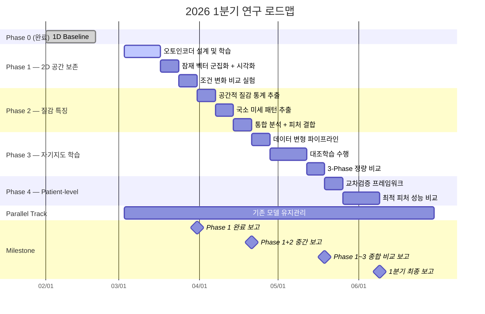

## Executive Summary

> [!abstract] 3줄 요약
> 1. **피드백 수용:** "1D Flatten 실패만으로 Whole Image 분석이 불가능하다고 단정할 수 없다" — 2D 공간 정보 보존 및 의료 영상 특화 기법을 단계적으로 증명해야 함.
> 2. **전략 전환:** 모델 구조 변경 이전에 **데이터의 특징 공간 자체를 깊이 분석**하여, 비지도 군집화로 질환 간 분리 가능 여부를 체계적으로 검증함.
> 3. **근거 기반:** 1년간 축적된 실험 결과(Image-level Acc 95% → Patient-level Malignant Recall <31% 급락)를 토대로, Feature-level 심층 분석이 현 단계 최우선 과제임을 입증함.

---

## 1. 연구 배경 및 문제 정의

### 1.1 현재까지의 연구 경과

> 상세 기록 → [[ITRC 연구계획/연구 히스토리 (2025.03~2026.03).md|연구 히스토리]]



### 1.2 핵심 문제 진단

| 문제 | 원인 분석 | 근거 |
|---|---|---|
| Patient-level Malignant Recall **<31%** | 다수 클래스 과적합, 소수 클래스 시그널 매몰 | 260219 미팅 — 8개 모델 비교 |
| 1D 기반 군집화 **실패** | 스펙클 노이즈와 배경 영역이 전체 분산을 지배 | 260219 미팅 — 선형 차원 축소 |
| Image-level ≠ Patient-level 성능 | 동일 환자 프레임 간 높은 유사도로 인한 데이터 누수 | 0818 미팅 — 환자 단위 재분할 |

### 1.3 교수님/선배님 피드백

> [!quote] 2026.02 랩미팅 핵심 피드백
> "단순 1D 변환이 안 된다고 해서 Whole Image 분석이 불가능하다고 확정 짓기엔 이르다. **2D 공간 정보를 보존**하거나 **의료 영상에 특화된 특징 압축 기법**을 단계적으로 더 시도하고 증명하라."

**→ 이 피드백을 수용하여 아래 5-Phase 로드맵을 수립함.**

---

## 2. 연구 토픽 및 우선순위

| 우선순위 | 토픽 | 목표 | 선행 조건 |
|---|---|---|---|
| **1순위** | **Topic A:** Image-level Feature 심층 분석 | 비지도 특징 공간에서 질환 간 분리 가능 여부를 단계적으로 증명 | — |
| **2순위** | **Topic B:** Patient-level 일반화 검증 | Topic A에서 도출된 최적 피처를 환자 단위 교차 검증에 적용 | Topic A 완료 |
| **후순위** | **Topic C:** 거시-미시 멀티 융합 | 국소 병변 피처와 전역 피처의 하이브리드 결합 | Topic A, B 완료 |

---

## 3. Phase별 세부 실행 계획

### Phase 0: 기 완료 — 1D Baseline

> [!success] 이미 수행하여 "한계"를 증명한 단계

- **실험 내용:** 전체 초음파 이미지를 1D로 펼친 뒤 선형 차원 축소(주성분 수 9단계 변화) 후 비지도 군집화
- **결과:** 클래스 간 구조적 분리 불가, 2D 시각화에서 넓은 중첩 확인
- **의의:** "1D 단순 변환 + 선형 축소"의 한계를 실험적으로 증명 → Phase 1~3의 필요성 근거

---

### Phase 1: 2D 공간 정보 보존형 특징 추출 — 최우선

> [!info] 핵심 가설
> 초음파 영상의 **2D 공간적 구조(인접 픽셀 간 관계)**를 보존하는 압축 표현으로 변환하면, 스펙클 노이즈에 의한 시그널 매몰을 극복하고 질환 간 군집 분리가 가능하다.

#### 접근 방식

합성곱 기반 오토인코더를 활용해 영상을 저차원 잠재 벡터로 압축한 뒤, 이 잠재 벡터 공간에서 비지도 군집화를 수행한다. 1D Flatten과 달리 합성곱 연산이 공간적 이웃 정보를 보존하므로, 배경 노이즈 대비 병변 시그널의 비중이 높아질 것으로 기대한다.

#### 주요 실험 변수

| 항목 | 범위 |
|---|---|
| 잠재 벡터 차원 | 64 / 128 / 256 / 512 비교 |
| 재구성 손실 | 픽셀 오차 + 구조적 유사도 가중 결합 |
| 입력 전처리 | 원본 vs 대비 강화 vs 스펙클 필터링 |
| 대상 영역 | Whole Image vs ROI Crop |

#### Actionable Steps

- [ ] **Step 1-1.** 오토인코더 설계 및 학습
  - 인코더(합성곱-정규화-활성화-풀링 반복) → 병목 잠재 벡터 → 디코더(역합성곱 대칭)
  - 재구성 손실이 수렴하면, 잠재 벡터가 영상의 핵심 구조 정보를 보존하고 있음을 의미

- [ ] **Step 1-2.** 잠재 벡터 추출 및 비지도 군집화
  - 학습 완료된 인코더로 전체 2,033장의 잠재 벡터 추출
  - k=2(양성/악성), k=4(4-type) 군집화 수행
  - 2D 시각화(t-SNE, UMAP)로 클래스 라벨 오버레이 → 분리 여부 확인
  - 군집 품질 지표(Silhouette Score, ARI, NMI) 정량 평가

- [ ] **Step 1-3.** 조건 변화 비교 실험
  - 잠재 차원 크기 변화에 따른 군집 품질 비교
  - 전처리 조건별, Whole Image vs ROI Crop 비교

> [!tip] 성공 기준
> 2D 시각화에서 **Type4(악성)가 시각적으로 분리 가능한 군집 형성**, 또는 Silhouette Score > 0.3

---

### Phase 2: 의료 영상 특화 통계적 질감 특징 추출 — 우선

> [!info] 핵심 가설
> 초음파 판독의 핵심인 **에코생성도**, **균질성**, **질감 패턴**을 통계적으로 정량화하면, 딥러닝 블랙박스 피처를 보완하는 해석 가능한 특징 공간을 구축할 수 있다.

#### 접근 방식

의료 영상 분석에서 전통적으로 사용되는 **공간적 회색조 상관 행렬 기반 특징**과 **국소 이진 패턴 기반 특징**을 추출한다. 이들은 영상의학과 전문의가 판독 시 실제로 보는 질감적 속성(대비, 균질도, 에너지 등)을 수학적으로 수치화한 것이므로, 딥러닝 피처와 상호보완적 역할을 기대할 수 있다.

#### 주요 추출 특징

| 특징 유형 | 추출 내용 | 임상적 의미 |
|---|---|---|
| 공간적 질감 통계 | 대비, 비유사도, 균질도, 에너지, 상관도 등 | 에코 패턴의 균질/불균질 정량화 |
| 국소 미세 패턴 | 다중 스케일 국소 패턴 히스토그램 | 미세 텍스처의 반복 구조 포착 |

#### Actionable Steps

- [ ] **Step 2-1.** 공간적 질감 통계 특징 추출
  - 다양한 거리와 방향 조합으로 특징벡터 추출
  - 전체 2,033장에 대해 배치 처리
  - 가설: 악성 용종은 불균질 에코를 보이므로 균질도↓, 대비↑ 경향

- [ ] **Step 2-2.** 국소 미세 패턴 특징 추출
  - 다중 스케일로 패턴 히스토그램 추출 후 결합
  - 가설: 콜레스테롤 폴립과 선암의 미세 텍스처 패턴이 이 공간에서 분리

- [ ] **Step 2-3.** 통합 분석 및 Phase 1 피처와의 비교/결합
  - 각 특징 단독 / 결합 / Phase 1 잠재 벡터와 혼합 → 각각 군집화 비교
  - 어떤 질감 특징이 군집 분리에 가장 기여하는지 중요도 분석
  - 최적 조합 도출

---

### Phase 3: 초음파 도메인 특화 자기지도 표현 학습 — 차순위

> [!info] 핵심 가설
> 레이블 없이도 초음파 영상의 고유한 구조적 패턴을 자기지도 방식으로 학습하면, 질환별 고유 텍스처가 임베딩 공간에서 자연스럽게 군집화된다.

#### 접근 방식

동일 영상의 서로 다른 변형(augmented view)끼리는 가깝게, 다른 영상과는 멀게 배치하도록 표현 공간을 학습하는 대조학습 프레임워크를 적용한다. 핵심은 초음파 영상의 물리적 특성에 맞는 데이터 변형 전략을 설계하는 것이다.

#### 초음파 특화 데이터 변형 설계

> [!warning] 일반 자연 이미지 변형을 그대로 적용하면 안 됨. 초음파의 물리적 특성 반영 필수.

| 변형 기법 | 적용 근거 |
|---|---|
| **무작위 자르기** | 다양한 스캔 각도와 확대율 반영 |
| **흐림 처리** | 스펙클 노이즈 변동성 시뮬레이션 |
| **밝기/대비 변동** | 장비 세팅(gain, TGC) 변동성 반영 |
| **스펙클 노이즈 주입** | 초음파 고유 노이즈 패턴 모사 |
| **좌우 반전** | 해부학적 좌우 대칭성 활용 |
| ~~색상 변형~~ | 초음파는 그레이스케일이므로 미적용 |
| ~~상하 반전~~ | 초음파 영상의 상하 방향은 물리적 의미가 있으므로 미적용 |

#### Actionable Steps

- [ ] **Step 3-1.** 초음파 특화 데이터 변형 파이프라인 구현
  - 변형 전후 시각화를 통해 의료 영상의 임상적 왜곡 여부를 수동 검증

- [ ] **Step 3-2.** 대조학습 수행 및 임베딩 추출
  - 동일 이미지의 두 변형 뷰를 유사하게, 나머지를 다르게 학습
  - 학습된 인코더에서 임베딩 벡터 추출

- [ ] **Step 3-3.** 임베딩 공간 군집화 및 Phase 1, 2 결과와 비교
  - 대조학습 임베딩으로 군집화 + 2D 시각화
  - 선형 분류기를 붙여 4-class 분류 정확도 측정 (표현 품질 평가)
  - **Phase 1 / Phase 2 / Phase 3 정량 비교표 작성**

---

### Phase 4: 최적 피처 → Patient-level 교차 검증 — Topic B

> [!info] 핵심 가설
> Phase 1~3에서 도출된 최적 피처 임베딩이, 환자 단위 분할에서도 일관된 분리 성능을 보이면, 임상적 분별력이 입증된다.

#### 접근 방식

Phase 1~3 중 가장 군집 분리가 잘 되는 피처(또는 결합)를 선택하여, **환자 ID 기준 교차 검증**으로 평가한다. 기존 실험에서 Malignant Recall이 31% 미만이었으므로, 이를 넘는 것이 핵심 목표다.

#### Actionable Steps

- [ ] **Step 4-1.** 환자 단위 교차 검증 프레임워크 구축
  - 환자 ID 기준 그룹 분할 (동일 환자 프레임이 Train/Test에 섞이지 않도록)
  - 프레임별 예측 → 환자별 집계 (다수결 투표 또는 확률 평균)

- [ ] **Step 4-2.** 최적 피처 적용 및 성능 비교
  - Phase 1~3 각각의 피처로 Patient-level 성능 측정
  - 핵심 비교: 기존 Malignant Recall <31% 대비 개선 여부
  - 피처 결합으로 추가 실험

---

### Parallel Track: 기구축 모델 유지관리 — 병렬 후순위

> 기존에 구축한 모델 자산을 유지하면서, 향후 멀티 융합을 위한 준비.

| 모델 | 역할 | 현재 상태 | 유지관리 항목 |
|---|---|---|---|
| 간 분할 모델 | 간 실질 영역 분할 | 구축 완료 | 주기적 추론 성능 확인 |
| 담낭/용종 탐지 모델 | ROI 검출 및 Crop | 구축 완료 | 새 데이터 적용 시 재검증 |
| Multi-branch Fusion | 해부학적 특징 분리 분류 | 구축 완료 | Phase 1~3 피처 통합 시 재활용 |
| 프레임별 임상 설명 시스템 | XAI 기반 판독 설명 | 구축 완료 | 최종 모델에 연동 예정 |

---

## 4. Task Master Table (Excel 변환용)

| 우선순위 | Phase | 연구 토픽 | 세부 실험 내용 | 목표일 | 상태 |
|---|---|---|---|---|---|
| P0 | Phase 0 | Baseline | 1D 펼침 → 선형 차원 축소 → 비지도 군집화 | 완료 | Done |
| P1 | Phase 1 | 2D 공간 보존 | 합성곱 오토인코더 설계 및 학습 | 3월 2주 | 진행 중 |
| P1 | Phase 1 | 2D 공간 보존 | 잠재 벡터 군집화 + 2D 시각화 | 3월 3주 | 대기 |
| P1 | Phase 1 | 2D 공간 보존 | 조건 변화 비교 실험 (차원/전처리/영역) | 3월 4주 | 대기 |
| P2 | Phase 2 | 질감 특징 | 공간적 질감 통계 특징 추출 | 4월 1주 | 대기 |
| P2 | Phase 2 | 질감 특징 | 국소 미세 패턴 특징 추출 | 4월 2주 | 대기 |
| P2 | Phase 2 | 질감 특징 | 통합 분석 + Phase 1 피처 결합 비교 | 4월 3주 | 대기 |
| P3 | Phase 3 | 자기지도 표현학습 | 초음파 특화 데이터 변형 파이프라인 구현 | 5월 1주 | 대기 |
| P3 | Phase 3 | 자기지도 표현학습 | 대조학습 수행 + 임베딩 추출 | 5월 3주 | 대기 |
| P3 | Phase 3 | 자기지도 표현학습 | Phase 1~3 정량 비교표 작성 | 5월 4주 | 대기 |
| P4 | Phase 4 | Patient-level | 환자 단위 교차검증 프레임워크 구축 | 6월 1주 | 대기 |
| P4 | Phase 4 | Patient-level | 최적 피처 Patient-level 성능 비교 | 6월 3주 | 대기 |
| 병렬 | Parallel | 모델 유지 | 기구축 탐지/분할/융합 모델 유지관리 | 상시 | 진행 중 |

---

## 5. 일정 간트 차트



---

## 6. 성공 기준 및 평가 매트릭스

| Phase | 성공 (Pass) | 부분 성공 (Partial) | 실패 (Fail) |
|---|---|---|---|
| **Phase 1** | 2D 시각화에서 Type4 군집 분리 + Silhouette > 0.3 | 일부 분리 경향 + Silhouette 0.15~0.3 | 1D Baseline과 동일 수준 중첩 |
| **Phase 2** | 질감 특징으로 군집 품질이 Phase 1 대비 개선 | 특정 특징에서만 유의미한 차이 | 질감 특징이 군집 분리에 기여 없음 |
| **Phase 3** | 선형 분류 Acc > 80% 또는 군집 ARI > 0.4 | 선형 분류 Acc 60~80% | 무작위 수준 |
| **Phase 4** | Patient-level Malignant Recall > **50%** | Recall 31~50% (소폭 개선) | Recall <31% (개선 없음) |

> [!important] 최종 판단 기준
> Phase 1~3 중 **하나라도 Pass**이면 → "Whole Image Feature 분석이 가능하다"는 근거 확보.
> **모두 Fail**이면 → "Whole Image에서 비지도 방식의 질환 분리는 불가능"을 실험적으로 증명 → ROI Detection 중심 전략으로 전환하는 근거로 활용.

---

## 7. 예상 리스크 및 대응 방안

| 리스크 | 발생 확률 | 영향도 | 대응 방안 |
|---|---|---|---|
| 오토인코더 학습 수렴 실패 | 중 | 높음 | 변분 오토인코더로 전환, 학습률 스케줄링 조정 |
| 2,033장으로 자기지도 학습 데이터 부족 | 높음 | 높음 | Open-set 10,692장을 비지도 사전학습에 활용 후 아주대 데이터로 적용 |
| 질감 특징 계산 시간 과다 | 낮음 | 낮음 | 병렬 처리, ROI 영역만 계산으로 범위 한정 |
| Patient-level 분할 시 Type3, 4 환자 수 부족 | 높음 | 중 | Leave-One-Out 또는 3-Fold로 축소 |
| GPU 메모리 부족 (대조학습) | 중 | 중 | 그래디언트 누적, 혼합 정밀도 학습 적용 |

---

## 8. Action Items

```dataview
TASK
WHERE contains(tags, "#research_roadmap") OR contains(tags, "#feature_extraction")
GROUP BY status
```

### 이번 주 (3월 1주)
- [ ] 선배님 피드백을 반영한 로드맵 엑셀 정리 및 공유 #research_roadmap
- [ ] 오토인코더 아키텍처 초안 설계 (레이어 수, 채널 수 결정) #feature_extraction
- [ ] 학습 데이터 전처리 파이프라인 점검 (리사이즈, 정규화) #feature_extraction

### Phase 1 (3월)
- [ ] 오토인코더 학습 코드 구현 #feature_extraction
- [ ] 잠재 차원 4종 비교 실험 #feature_extraction
- [ ] 2D 시각화 모듈 구현 #feature_extraction
- [ ] 군집 품질 평가 코드 구현 #feature_extraction
- [ ] Phase 1 결과 정리 및 보고 #research_roadmap

### Phase 2 (4월)
- [ ] 공간적 질감 통계 특징벡터 추출 스크립트 #feature_extraction
- [ ] 국소 미세 패턴 다중 스케일 추출 스크립트 #feature_extraction
- [ ] Phase 1 피처와의 결합 군집화 비교 #feature_extraction
- [ ] 특징 중요도 분석 #feature_extraction

### Phase 3 (5월)
- [ ] 초음파 특화 데이터 변형 파이프라인 구현 및 검증 #feature_extraction
- [ ] 대조학습 수행 + 임베딩 추출 #feature_extraction
- [ ] Phase 1~3 정량 비교표 작성 #research_roadmap

### Phase 4 (6월)
- [ ] 환자 단위 교차검증 프레임워크 구축 #feature_extraction
- [ ] 최적 피처 Patient-level Malignant Recall 측정 #feature_extraction
- [ ] **1분기 최종 보고서 작성** #research_roadmap
