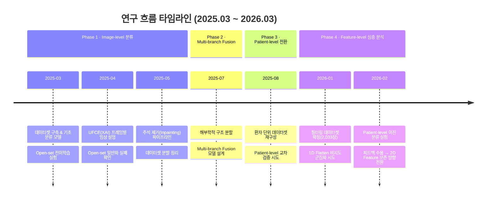

## 한줄 요약

> 담낭 초음파 이미지 기반 딥러닝 진단 모델 연구를 **Image-level 단일 분류 → 해부학적 Multi-branch Fusion → Patient-level 재구성 → Feature-level 심층 분석**으로 단계적 발전시켜 온 1년간의 연구 기록.

---

## 1. 연구 개요

- **소속:** 아주대학교 인공지능융합네트워크학과 석사과정 (Embedded & Software Lab.)
- **과제:** ITRC — 담낭 초음파 영상 기반 딥러닝 질환 진단 모델 개발
- **최종 목표:** 담낭 용종의 종양성/비종양성 분류 → 진단 근거 도출 → 위험도(%) 출력
- **데이터셋:** 아주대 병원 138명 환자, 원본 9,403장 (TIF) → 필터링 후 **2,033장**

| 병변 유형 | 환자 수 | 필터링 이미지 수 |
|---|---|---|
| Type 1: 콜레스테롤 폴립 | 87명 (191건) | 1,323장 |
| Type 2: 염증성 폴립 | 28명 (55건) | 356장 |
| Type 3: 선근종성 폴립 | 8명 (16건) | 136장 |
| Type 4: 선암/암 | 15명 (32건) | 218장 |
| **계** | **138명 (294건)** | **2,033장** |

---

## 2. 연구 타임라인



---

## 3. Phase별 상세 기록

### Phase 1: Image-level 단일 분류 모델 (2025.03 ~ 2025.05)

> **핵심 질문:** 초음파 이미지만으로 4개 질환 유형을 분류할 수 있는가?

#### 3.1.1 데이터 전처리 파이프라인 구축 `250304`

- 원본 TIF 9,403장에서 **담낭이 촬영된 영상만 수동 필터링** → 2,033장
- 부채꼴 영역 Contour 기반 외곽선 탐색 → Mask 생성 → Cropping 전처리
- 개인정보 비식별화(Anonymization): Gaussian Blur → 이진 임계값 → Morphological Closing → 텍스트 영역 마스킹

#### 3.1.2 단일 분류 모델 실험 `250304`

| 모델 | Accuracy | Type4 Recall | Macro F1 | 비고 |
|---|---|---|---|---|
| EfficientNet-B0 (단일) | **0.91** | 0.89 | 0.88 | Baseline |
| 앙상블 (EffNet + ResNet + DenseNet) | 0.84 | 0.61 | 0.77 | Majority Voting, 오히려 하락 |

- **발견:** 히트맵 분석 결과 모델이 담낭이 아닌 주변 영역에 집중하는 경향
- **원인 분석:** ImageNet 사전학습 가중치의 초음파 도메인 부적합, Random Crop에 의한 담낭 영역 절삭

#### 3.1.3 대규모 Open-set 전이학습 `250325`

- **Mendeley Data** 담낭 질환 Open-set (9개 클래스, 10,692장) 활용
- Pretraining → Fine-tuning Stage 1 (Classifier only) → Stage 2 (Full Unfreeze)

| 모델 | Accuracy | Macro F1 | 비고 |
|---|---|---|---|
| EfficientNet-B0 (전이학습) | **0.95** | 0.94 | 단일 대비 +0.06 |
| Swin Transformer Tiny | 0.93 | 0.92 | Transformer vs CNN 유의미한 차이 없음 |
| ConvNeXt-Base | 0.93 | 0.91 | CNN 최신 아키텍처 |
| EfficientNet-B4 + Mixup | 0.93 | 0.92 | 모델 규모↑ 효과 미미 |
| EfficientNet-B0 + Curriculum Learning | **0.95** | 0.94 | 텍스처 바이어스 완화 효과 |

> [!important] 핵심 결론
> 모델 구조나 학습 기법 차이보다 **Open-set 사전학습된 백본**이 가장 큰 성능 개선 요소. 경량 모델(B0)로도 충분한 성능 달성.

#### 3.1.4 UFCE (Ultrasound Frame-wise Clinical Explanation) `250403`

- XAI 기반 **프레임별 임상 설명 시스템** 구현
- 폴더(환자) 단위 프레임 분석 → 개별 예측 시퀀스 그래프 → 투표 기반 최종 판정
- Type0(담낭 미포함) 필터링을 위한 이진 분류 모델 사전 단계 적용

#### 3.1.5 Open-set 일반화 검증 실패 `250429`

| 실험 조건 | Test Accuracy | Type4 Recall | 판정 |
|---|---|---|---|
| Open-set 학습 → 아주대 Test | **0.11** | 0.41 | ❌ 완전 실패 |
| 아주대 학습 → Open-set Test | 0.23 | 0.07 | ❌ 완전 실패 |

- **결론:** 두 데이터셋 간 도메인 갭이 극심 → 단순 전이학습으로 일반화 불가
- ROI Crop(담낭 영역 추출) 시 소폭 개선 확인 → 배경 제거의 중요성 재확인

#### 3.1.6 주석 제거 & 데이터 정비 `250513` `250527`

- **Inpainting 파이프라인:** Roberts 연산자 → 컴포넌트 필터링 → 마스크 확장 → INPAINT_TELEA
- 성능: MSE 97.09, PSNR 28.68dB, **SSIM 0.9625** (구조적 유사도 양호)
- Train/Val/Test 데이터셋 분할표 정리 완료

---

### Phase 2: Multi-branch Fusion 모델 (2025.07)

> **핵심 질문:** 해부학적 구조 정보를 명시적으로 분리하여 학습하면 성능이 올라가는가?

#### 3.2.1 해부학적 구조 분할 파이프라인 `250707`

```
원본 이미지 → 부채꼴 윤곽 검출 → 간 검출 → 담낭 검출
                                              → Region Growing → 최종 마스크
```

- 노이즈 제거 및 대비 강화 적용
- 담낭벽 및 용종 모양 별도 검출

#### 3.2.2 Multi-branch 아키텍처 설계 및 실험 `250707`

| Branch | 입력 | 추출 특징 |
|---|---|---|
| Branch 1 | 원본 이미지 | 전반적 질감, 명암, 미세 노이즈 패턴 |
| Branch 2 | 해부학적 구조화 이미지 | 담낭-주변 구조 상호작용 정보 |
| Branch 3 | 담낭벽/용종 검출 이미지 | 경계선의 기하학적·형태학적 정보 |
| Branch 4 | 대비 강화 이미지 | 용종 내부 에코텍스처 패턴 |

**→ 4개 특징벡터 Concat → 분류기 → 최종 예측**

| 모델 구성 | Accuracy | Type4 Recall | F1 |
|---|---|---|---|
| Standard (원본 단일) | 89.66% | 77.21% | 0.85 |
| Fusion (원본 + 구조) | 93.09% | 86.05% | 0.90 |
| Fusion (원본 + 용종/벽) | **93.52%** | **88.84%** | **0.91** |
| Fusion (원본 + 대비향상) | 93.32% | 86.98% | 0.91 |
| Fusion (4가지 특징 전체) | **93.58%** | **93.02%** | **0.91** |

> [!success] 핵심 성과
> Multi-branch Fusion으로 **Type4(암) Recall이 77% → 93%로 약 16%p 향상**. 해부학적 구조 분리가 분류 성능에 유의미한 기여 입증.

---

### Phase 3: Patient-level 전환 (2025.08 ~ 2026.01)

> **핵심 질문:** Image-level에서의 높은 정확도가 Patient-level에서도 유지되는가?

#### 3.3.1 환자 단위 데이터셋 재구성 `0818`

| Type | 환자_날짜 수 | 이미지 수 | 환자당 평균 프레임 |
|---|---|---|---|
| Type 1 | 191건 | 1,274장 | 6.67장 |
| Type 2 | 55건 | 356장 | 6.47장 |
| Type 3 | 16건 | 136장 | 8.50장 |
| Type 4 | 32건 | 218장 | 6.81장 |

- 기존 이미지 단위 랜덤 분할 → **환자 단위 분할**로 전환 (Train/Valid/Test에 동일 환자 중복 방지)
- 다각도 촬영 및 확대 영상의 특성 분석

#### 3.3.2 Patient-level 이진 분류 실험 `260219`

- 양성(Type1~3) vs 악성(Type4) 이진 분류로 전환
- **Malignant Recall 심각하게 저조** (최대 30.56%)
- 다수 모델 실험 결과:

| 모델 | 데이터셋 | Malignant TP | Malignant Recall |
|---|---|---|---|
| EfficientNetB0 | 원본 | 12/81 | 14.81% |
| EfficientNetB0 | ROI | 11/81 | 13.58% |
| RadFormer | 원본+ROI | 10/81 | 12.35% |
| MobileNetV2 | CLAHE 원본 | 22/72 | **30.56%** |
| GBCNet | ROI | 8/80 | 10.00% |
| ViT + XGBoost | ROI | 6/78 | 7.50% |

> [!warning] 핵심 문제
> - 다수 클래스(Type1)로의 **과적합 문제가 심각**
> - 데이터의 품질과 분포를 개선하는 것이 가장 중요한 요소
> - 단순 데이터 증강 및 전처리는 성능 향상에 큰 도움이 되지 않음

---

### Phase 4: Feature-level 심층 분석으로 전환 (2026.01 ~ 현재)

> **핵심 질문:** 모델 구조를 바꾸기 전에, 데이터 자체의 특징 공간에서 질환 간 분리가 가능한가?

#### 3.4.1 1D Flatten 비지도 군집화 시도 `260219`

- 전체 초음파 이미지를 1D Flatten → PCA 차원 축소 → K-Means 군집화
- **결과:** 명확한 군집 형성 실패, 클래스 간 넓게 중첩
- **원인:** 스펙클 노이즈 + 간 실질 등 방대한 배경 노이즈로 임상 시그널(용종) 매몰

#### 3.4.2 기존 Fusion 특징 기반 분석 `260219` `260226`

- 기구축된 4가지 특징(원본, 구조, 윤곽, CLAHE)을 활용한 분류 재검증
- Cluster 확률벡터를 Feature에 결합하는 방식 시도
- Grad-CAM vs Integrated Gradients 비교 분석
  - **IG가 더 효과적:** 원본 해상도 기반, 양/음 기여도 명확, 과적합 시 노이즈 의존 확인 가능

#### 3.4.3 교수님/선배님 피드백 (2026.02 랩미팅)

> [!quote] 핵심 피드백
> "단순 1D 변환이 안 된다고 해서 Whole Image 분석이 불가능하다고 확정 짓기엔 이르다. **2D 공간 정보를 보존**하거나 **의료 영상에 특화된 특징 압축 기법**을 단계적으로 더 시도하고 증명하라."

→ **[[ITRC 연구계획/2026 1분기 연구계획_.md|2026 1분기 연구계획]]** 수립: 2-Stage Feature 심층 분석 방향으로 전환

---

## 4. 핵심 인사이트 누적 정리

| # | 시점 | 인사이트 | 영향 |
|---|---|---|---|
| 1 | 25.03 | ImageNet 사전학습 → 초음파 도메인 부적합 | Open-set 전이학습 도입 |
| 2 | 25.03 | 모델 구조 < 사전학습 백본의 영향이 더 큼 | 경량 모델(B0) 유지 결정 |
| 3 | 25.04 | Open-set ↔ 아주대 도메인 갭 극심 | 단순 전이학습 일반화 한계 확인 |
| 4 | 25.04 | ROI Crop 시 분류 소폭 개선 | 배경 제거의 중요성 재확인 |
| 5 | 25.07 | 해부학적 구조 분리 → Type4 Recall 16%p↑ | Multi-branch Fusion 유효성 입증 |
| 6 | 25.08 | Image-level ≠ Patient-level 성능 | 환자 단위 평가 체계 필수 |
| 7 | 26.01 | 1D Flatten 군집화 → 노이즈에 의한 시그널 매몰 | 2D 공간 보존 방식 전환 필요 |
| 8 | 26.01 | Patient-level 이진 분류 Malignant Recall < 31% | 과적합 심각, 데이터 분포 개선 최우선 |
| 9 | 26.02 | IG > Grad-CAM (과적합 분석 시) | XAI 기법 전환 |
| 10 | 26.02 | 교수님 피드백: 2D 특징 보존 + 도메인 특화 기법 | 2026 1분기 연구계획 수립 |

---

## 5. 현재 보유 모델/파이프라인 자산

| 구분 | 모델/기법 | 상태 | 비고 |
|---|---|---|---|
| 담낭 검출 | YOLOv8 | ✅ 구축 완료 | Bounding Box + Crop |
| 질환 분류 | EfficientNet-B0 (전이학습) | ✅ 구축 완료 | Image-level Acc 95% |
| 간 분할 | TransUNet | ✅ 구축 완료 | Segmentation |
| 담낭벽 분할 | TransUNet | ✅ 구축 완료 | Segmentation |
| Multi-branch Fusion | 4-Branch CNN | ✅ 구축 완료 | Image-level Acc 93.58% |
| 주석 제거 | Inpainting (TELEA) | ✅ 구축 완료 | SSIM 0.96 |
| XAI | Grad-CAM++, IG | ✅ 구축 완료 | IG 성능 우수 |
| 비지도 군집화 | 1D Flatten + PCA + K-Means | ❌ 실패 확인 | 2D 보존 방식 전환 예정 |

---

## 6. 현재 연구 방향 (2026 1분기~)

```
┌─────────────────────────────────────────────────────────┐
│                  Topic A (1순위)                         │
│          Image-level Feature 심층 분석                    │
│                                                         │
│  Step 1: 2D 공간 보존 차원 축소 (CAE → Latent → K-Means) │
│  Step 2: 임상 질감 정량화 (GLCM, LBP)                    │
│  Step 3: 초음파 특화 대조학습 (SimCLR/MoCo)               │
├─────────────────────────────────────────────────────────┤
│                  Topic B (2순위)                         │
│          Patient-level 일반화 검증                        │
│                                                         │
│  Step 4: 최적 피처 임베딩 → 환자 단위 교차 검증            │
├─────────────────────────────────────────────────────────┤
│                  Topic C (후순위)                         │
│          거시-미시 멀티 융합                               │
│                                                         │
│  Step 5: ROI + 전역 피처 융합 아키텍처                     │
└─────────────────────────────────────────────────────────┘
```

> 상세 계획 → [[ITRC 연구계획/2026 1분기 연구계획_.md|2026 1분기 연구계획]]

---

## 7. 미팅자료 아카이브

| 날짜 | 파일명 | 주요 내용 |
|---|---|---|
| 2025-03-04 | `250304 ITRC_세현 고.pdf` | 과제 개요, 데이터셋, 단일/앙상블 분류, 전처리 파이프라인 |
| 2025-03-25 | `250325 ITRC_세현_고.pdf` | Open-set 전이학습, 다중 모델 비교, Curriculum Learning |
| 2025-04-03 | `250403 ITRC_세현.pdf` | UFCE(XAI) 프레임별 임상 설명 시스템 |
| 2025-04-29 | `250429 ITRC_세현_R.pdf` | Open-set 일반화 검증 실패, ROI Crop 효과 분석 |
| 2025-05-13 | `250513 ITRC_세현.pdf` | 초음파 주석 제거 Inpainting 파이프라인 |
| 2025-05-27 | `250527 ITRC_세현고.pdf` | 데이터셋 분할표 정리, Full/ROI/Margin 비교 |
| 2025-07-07 | `250707 ITRC_세현.pdf` | 해부학적 분할, Multi-branch Fusion, 성능 비교 |
| 2025-08-18 | `ITRC 0818_세현.pdf` | 환자 단위 데이터 재구성, 서베이 모델 비교 |
| 2026-01-26 | `260219_세현_미팅.pdf` | 필터링 데이터셋 확정, 1D 군집화 실패, Fusion 재검증 |
| 2026-02-26 | `ITRC 260226 세현.pdf` | Patient-level 이진 분류, IG 분석, 향후 방향 |
